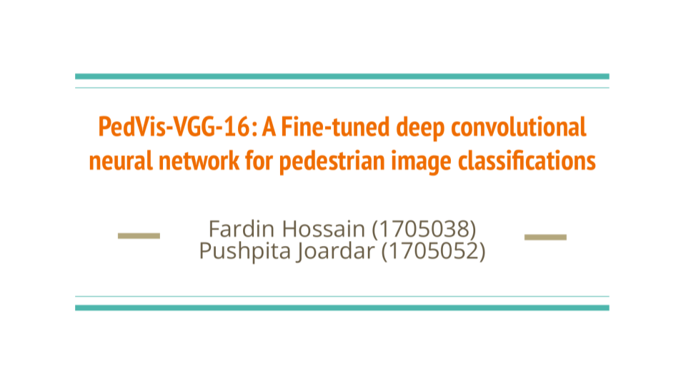
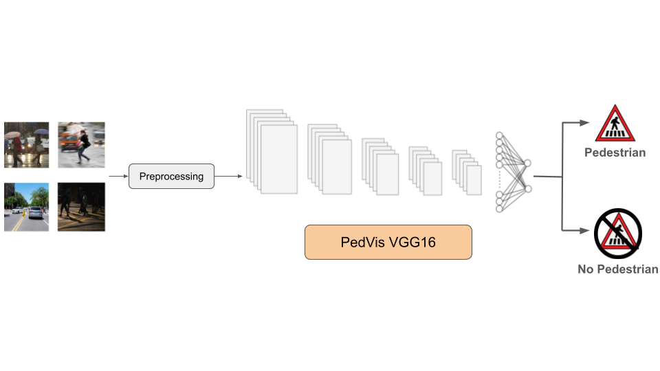

## Overview

In this project, we aim to build a deep convolutional neural network named PedVis VGG16, a fine-tuned version of the widely used VGG16 architecture, for pedestrian image classification. The objective of this model is to automatically detect the presence of pedestrians in images with high accuracy.

## Dataset

A combined dataset that is mostly based on the INRIA Person Dataset (https://www.kaggle.com/datasets/pushpitajoardar/train-data-v1)

## Proposed Solution

## Code Overview

The repository contains three notebooks:

- **`new-combined.ipynb`** – Implements the **PedVis VGG16** model.  
- **`inner-layer-change.ipynb`** – Used for experimenting with adding or removing layers in the CNN architecture.  
- **`newresnet.ipynb`** – Tests **ResNet50** on the dataset to compares its performance against PedVis VGG16.

## Model Details

- Base Architecture: VGG16
- Learning Rate: 0.0001
- Optimizer: Adam
- Loss Function: Categoriacal Cross-Entropy

## Presentation Report

https://drive.google.com/file/d/15NhWZTATkKM62ebIf5P-6dlBuqFbLAIt/view?usp=sharing

## Reference

[1] **PedVis-VGG-16: A Fine-tuned deep convolutional neural network for pedestrian image classifications** (https://ieeexplore.ieee.org/document/9966465)
